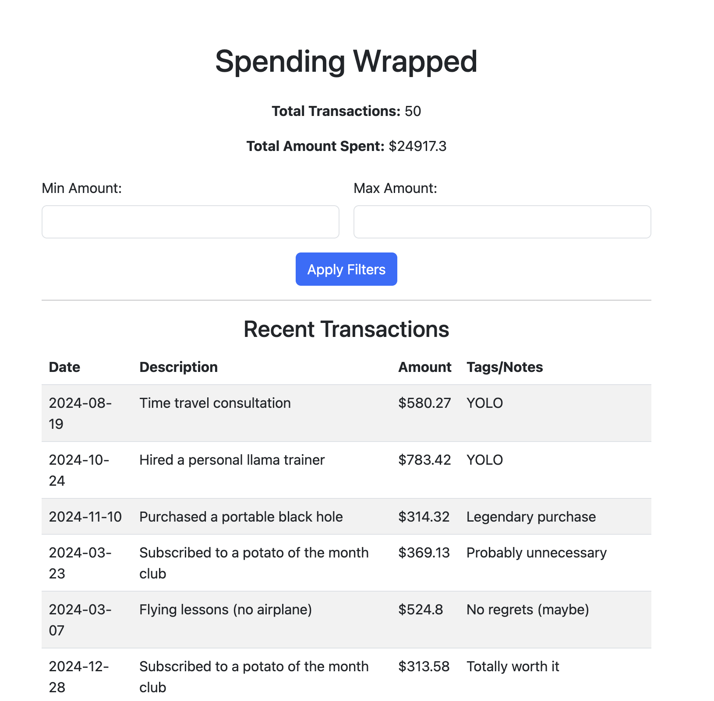

# Spending Wrapped

Spending Wrapped is a **Flask web application** that allows users to **upload transaction data (CSV)** and visualize their spending habits using an interactive dashboard.



# why flask
- lightweight and simple 
- rapid prototyping

## 📦 Installation & Running Locally
### 🔹 Install Dependencies
```bash
pip install -r requirements.txt